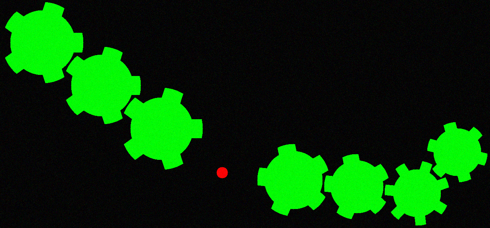
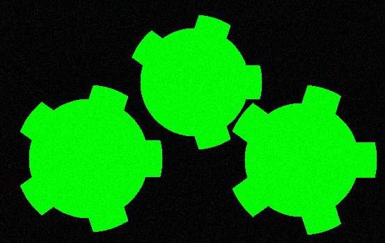

# Gear project - repair mechanism

The goal of this computer graphic project is image analisys and search of missing and broken gear and its "repair".

Language: C++. Compiler: Microsoft Visual C++

 ## Main algorithms:
 
<li>Image binarization

<li>Objects separation and classification (axis or gear)

<li>Paste suitable gear

<li>Search of broaken gear and repair
