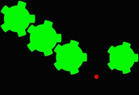
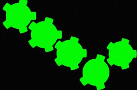
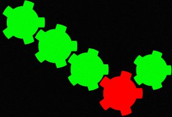

# "Repair mechanism" project

The goal of this computer graphics project is image analysis, search of missing or broken gear and its "repair".

Language: GNU C++.






## Main used algorithms
 
<li>Image binarization

<li>Objects separation and classification (axis or gear)

<li>Paste suitable gear

<li>Search of broken gear and repair

<li>Noise reduction

## How to compile and execute

To compile the project, please go to project's root folder and run

```bash
make all
```

To execute the project, please go to build/bin project's folder

```bash
./main
```

(or ```main.exe``` in case of Windows).
